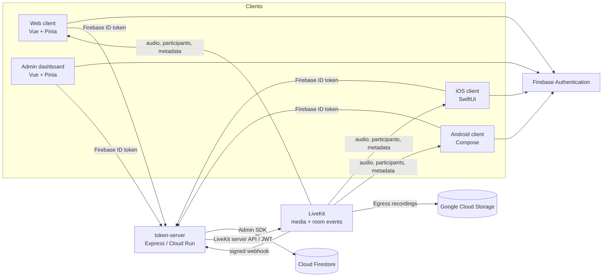
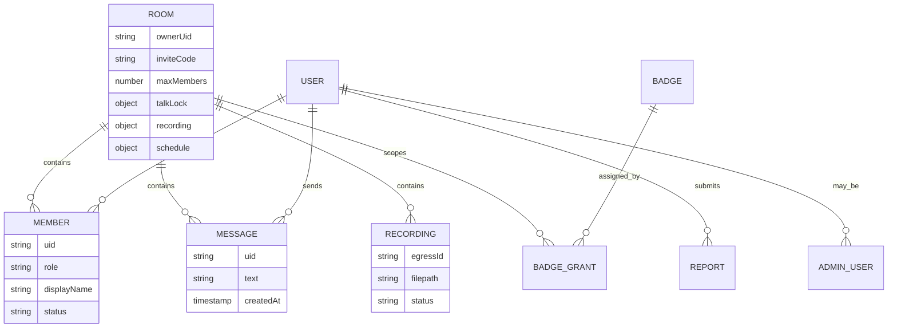
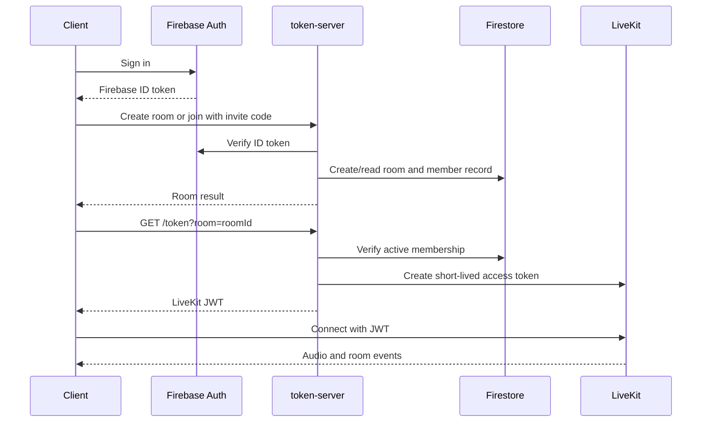

# Architecture

## Overview

FirebaseRTC is a room-first, real-time push-to-talk (PTT) platform. A user
authenticates with Firebase, creates or joins an invite-only room through the
application backend, and then connects to LiveKit for low-latency media and
room events. A room is the primary unit of communication; it owns members,
messages, recordings, and moderation state.

## Repository layout

| Path | Responsibility |
| --- | --- |
| `ptt-client/` | User-facing web client built with Vue 3, Vite, Pinia, Firebase SDK, and LiveKit SDK. |
| `ptt-ios/` | Native iOS client built with SwiftUI. |
| `ptt-android/` | Native Android client built with Kotlin and Jetpack Compose. |
| `token-server/` | Authoritative Express backend for identity verification, authorization, room lifecycle, and LiveKit integration. |
| `admin-dashboard/` | Separate Vue application for operational and organization-level administration. |
| `shared/` | Shared CSS design tokens for the web applications. |
| `firestore.rules` | Firestore client-access policy. |
| `firebase.json` | Firebase Hosting targets and Firestore deployment configuration. |

The web client and the admin dashboard are separate Firebase Hosting SPAs. The
token server is containerized (`token-server/Dockerfile`) and is designed to be
deployed independently, for example to Cloud Run.

## Runtime responsibilities

### Clients

All three user clients follow the same functional model:

1. Complete onboarding and sign in with Firebase Authentication.
2. Create a room or join one with its invite code.
3. Request a LiveKit JWT from `token-server` and connect with the LiveKit SDK.
4. Hold the PTT control only after acquiring the server-enforced talk lock.
5. Use Firestore listeners for chat history and for their own membership status.

The web client additionally supports image, video, and PDF attachments. It asks
the token server for a short-lived GCS upload URL, uploads directly to GCS, and
then creates the chat message through the normal server API. The iOS and Android
clients currently support text chat but not attachment UI.

The clients do not treat their local UI state as authorization. UI state can
hide unavailable actions, but the token server checks membership and roles for
every protected action.

### Token server

`token-server/server.js` mounts the backend routes. It has three key roles:

- Verify Firebase ID tokens and derive the caller's UID.
- Apply all room, role, moderation, recording, organization, badge, and admin
  authorization rules using Firestore through the Firebase Admin SDK.
- Call LiveKit's server APIs to mint connection tokens, update room metadata,
  remove banned participants, and control Egress recordings.

Important shared backend modules keep cross-cutting behavior centralized:

| Module | Responsibility |
| --- | --- |
| `middleware/requireAuth.js` | Firebase token verification and request validation. |
| `middleware/requireAdmin.js` | Permission checks based on `adminUsers/{uid}`. |
| `lib/firebaseAdmin.js` | Firebase Admin SDK initialization. |
| `lib/roomMetadata.js` | Combines talk-lock and recording state into one LiveKit Room Metadata update. |
| `lib/auditLog.js` | Best-effort audit log creation for administrative actions. |

The public API is documented in [API.md](API.md).

### Firebase and Firestore

Firebase Authentication is the system of record for user identity. Firestore
stores application state, but it is deliberately not a general client-write
database. `firestore.rules` denies direct client writes; state changes are made
by the token server through the Admin SDK.

The intentional read exceptions are:

- a user may observe their own `rooms/{roomId}/members/{uid}` document, so a
  ban or display-name change appears immediately in the UI;
- an active room member may read that room's message history for realtime chat.

This makes Firestore useful as a controlled realtime projection while keeping
invite-code validation, moderation, message validation, and role changes on the
server.

### LiveKit

LiveKit carries real-time audio and publishes room events. It does not decide
whether a user may enter a room: the token server issues a short-lived LiveKit
JWT only after checking Firestore membership.

The token server also writes two pieces of application state into LiveKit Room
Metadata:

- `currentTalker`: the UID that currently holds the PTT lock;
- `recording`: whether a room recording is active and when it started.

Every connected client receives those updates through LiveKit's room metadata
event, which avoids polling for live PTT and recording indicators.

## Core data model

The canonical Firestore paths are:

- `rooms/{roomId}` — room configuration and current transient state.
- `rooms/{roomId}/members/{uid}` — membership, role, status, and display name.
- `rooms/{roomId}/messages/{messageId}` — persistent text-chat history.
- `rooms/{roomId}/recordings/{egressId}` — finalized recording history.
- `reports`, `auditLogs`, `adminUsers`, `organizations`, `badges`, and
  `badgeGrants` — cross-room operational data.

See [DATA_MODEL.md](DATA_MODEL.md) for the fields, retention behavior, and
authorization intent.

## Primary flows

### Create or join and connect

### Push-to-talk lock

PTT exclusivity is enforced server-side, not merely by disabling a button in
other clients. `POST /rooms/:roomId/talk/start` performs a Firestore
transaction to acquire the lock. The holder sends heartbeats to extend it and
calls `talk/stop` to release it. On every change, the server synchronizes the
combined room metadata to LiveKit so all clients can display the active speaker.

### Chat and moderation

Clients submit text to `POST /rooms/:roomId/messages`; the server validates and
writes it. Active members then receive it through their Firestore query
listener. This is intentionally not a LiveKit data channel, because the system
needs durable history, server-side validation, and immediate loss of read
access when a member is banned.

When an owner or moderator bans a participant, the backend marks the membership
as banned *and* calls LiveKit to remove that participant. The two actions cover
both persistent authorization and an already-open media connection.

### Recording lifecycle

Owners and moderators request recording start and stop through the token server.
LiveKit Room Composite Egress writes the mixed room audio to GCS. A signed
LiveKit webhook is the authoritative completion signal: it finalizes recording
state and writes history after `egress_ended`. This avoids declaring a recording
finished merely because a stop request was accepted.

### Room schedule (start/end time gate)

*Added 2026-08-05.* A room can optionally carry a `schedule` of `{ start, end }`
timestamps (either may be `null`, meaning open-ended / joinable immediately).
`token-server/lib/roomSchedule.js` derives one of three states —
`before_start`, `in_session`, `after_end` — and this is treated as an axis
independent from, and ANDed with, room-role permissions
(`lib/permissions.js`): a member with permission to send a chat message is
still blocked outside `in_session`. `before_start` allows only joining and a
waiting screen; `after_end` allows joining and reading chat history but not
sending or talking. `firestore.rules` enforces the `before_start` chat-read
restriction independently, defending against stale/legacy rooms that predate
this field by defaulting to "no restriction" when `schedule` is absent.

Expiry is detected two ways: synchronously when an admin edits the schedule to
a time already in the past (`PATCH /admin/rooms/:roomId/schedule`), and via a
periodic sweep (`POST /internal/rooms/sweep-expired`, protected by a shared
secret, intended to be called by Cloud Scheduler). Both paths call the same
idempotent `expireRoom()`, which force-disconnects active LiveKit participants
and marks `schedule.expiredAt`.

This feature is implemented in the web client and admin dashboard only; the
iOS and Android clients do not yet have any schedule-aware UI (see
`brushup-plan.md`, 五十三訂).

## Trust and security boundaries

| Boundary | Enforcement |
| --- | --- |
| Client to backend | Firebase ID token in `Authorization: Bearer …`; backend verifies it with Firebase Admin SDK. |
| Client to Firestore | Security rules deny writes and restrict reads to self-membership and active-room chat. |
| Backend to LiveKit | Server-only API credentials issue JWTs and perform moderation/Egress actions. |
| LiveKit to backend | Signed webhook verification; raw request body is preserved for that route. |
| Browser to backend | Explicit `ALLOWED_ORIGINS` CORS allow-list. |
| Admin operations | Permission checks stored in `adminUsers`, plus best-effort audit logging. |

## Admin architecture

The admin dashboard is separate from the user-facing client. It signs in with
Firebase Auth but calls privileged `/admin/*` APIs rather than directly reading
admin collections. Permissions such as `rooms:monitor`, `audit:read`,
`organizations:manage`, and `badges:manage` are checked by the backend. The
dashboard currently covers room monitoring, audit logs, administrator accounts,
organizations, badges, and users.

## Current scope and future work

The implemented architecture covers authentication, invite-only rooms, PTT
voice, text chat, image/video/PDF attachments on the web client, moderation,
recording, organization management, badges, room scheduling (web/admin only),
and administration. Native attachment UI parity aside, schedule-aware UI on
iOS/Android, AI participants, notifications, location events, reactions, and
broader event types remain future work.

Future extensions should preserve the existing boundary: clients request an
action, the token server authorizes and persists it, and LiveKit or Firebase
provides the appropriate realtime delivery mechanism.
